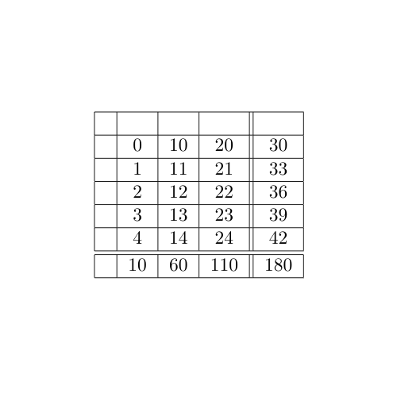
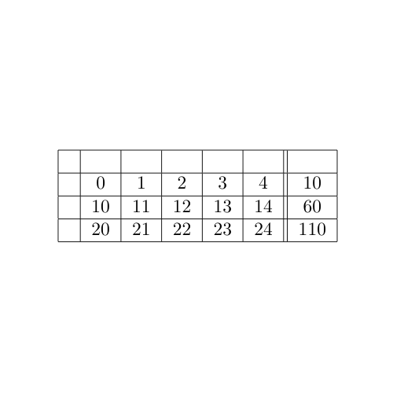
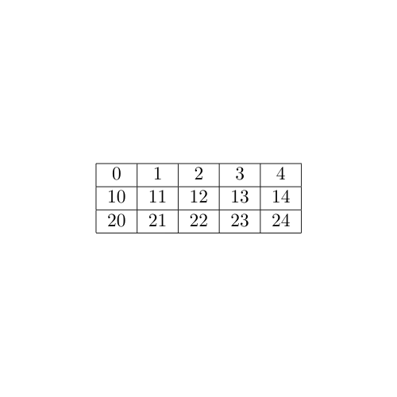

# **[ASU][Projekt 1][zadanie 8 - tabelki]**
## *Polecenie*
Proszę napisać skrypt do tworzenia tabelek w LaTeXu: z pliku z liczbami oddzielonymi jakimiś separatorami
(spacje, nowe wiersze, średniki — zbiór sep. powinien być definiowalny) zrobić tabelkę o zadanej liczbie
kolumn. Dokładać (włączane przez opcje) podsumowanie w wierszach, kolumnach, puste nagłówki wierszy
i kolumn. Zapewnić możliwość obrócenia tabeli o 90 stopni (tzn. dane podane w pliku wierszami umieścić
w kolumnach).
## *Parametry wywołania skryptu*
* -tr transpozycja wartości tabeli
* nagłówki
    * -hc dla kolumn
    * -hr dla wierszy
* sumowanie
    * -sc suma po kolumnach
    * -sr suma po wierszach
* separatory
    * -c=? dla kolumn gdzie ? to separator nieposiadający cyfry w swoim ciągu znaków
    * -r=? dla wierszy gdzie ? to separator nieposiadający cyfry w swoim ciągu znaków
    
    separatory muszą być unikalne i mogą być tylko jednoznakowe. Liczba separatorów nie jest ograniczona
* ścieżki plików
    * -in= dla ścieżki wejściowej
    * -out= dla ścieżki wyjsciwej
    
    arguemnty -in= i -out= są obowiązkowe
    
    
## *Uruchomienie*
Aby wygenerować tabelę w LaTeXie należy wywołać polecenie z głównego katalogu projektu:
```
perl src/LaTeX\ table\ generator.pl -c=- -r=\; -in=src/in.txt -out=src/out.txt
```
## *Przykłady*

plik wejściowy:
``` text
0-1-2-3-4;10-11-12-13-14;20-21-22-23-24;
```
polecenie uruchamiające:
``` text
perl src/LaTeX\ table\ generator.pl -tr -hc -hr -sr -sc -c=- -c=. -r=\; -r=\' -in=src/in.txt -out=src/out.txt
```
uzykana tabela:



polecenie uruchamiające:
``` text
perl src/LaTeX\ table\ generator.pl -hc -hr -sc -c=- -c=. -r=\; -r=\' -in=src/in.txt -out=src/out.txt
```
uzykana tabela:



polecenie uruchamiające:
``` text
perl src/LaTeX\ table\ generator.pl -c=- -c=. -r=\; -r=\' -in=src/in.txt -out=src/out.txt
```
uzykana tabela:

